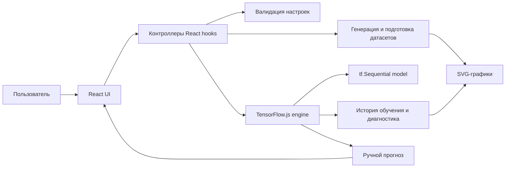
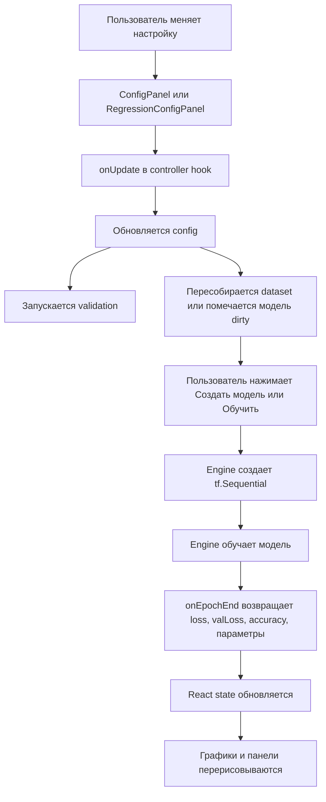
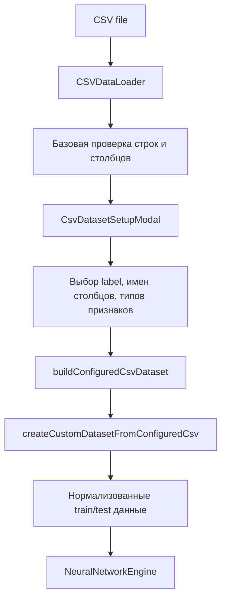

# Архитектура проекта

Документ подробно объясняет, как устроено веб-приложение для интерактивного изучения принципов работы нейронных сетей: frontend, графики, обработка данных, TensorFlow.js-ядро и связь с backend-частью.

Главная идея проекта: пользователь меняет параметры нейросети, датасет и настройки обучения, а приложение сразу показывает, как это влияет на модель, метрики, веса, смещения, границы решений и прогнозы.

## 1. Общая архитектура

Проект построен как одностраничное React-приложение. Отдельного серверного backend в текущей версии нет: модель создается, обучается и применяется прямо в браузере через TensorFlow.js.



Слои приложения:

- `src/App.jsx` и `src/pages/` - страницы и общий каркас интерфейса.
- `src/components/` - визуальные компоненты: настройки, графики, предпросмотр данных, прогнозы, веса.
- `src/hooks/` - контроллеры состояния: связывают интерфейс, данные и TensorFlow.js.
- `src/core/` - вычислительная логика: CSV, датасеты, нормализация, TensorFlow.js-модели.
- `src/config/` - значения по умолчанию, списки опций и лимиты.
- `src/utils/` - форматирование и валидация.
- `src/styles.css` - вся визуальная система.
- `public/datasets/` - примерные CSV-файлы.
- `dist/` - production-сборка для статической раздачи.

## 2. Технологии

В `package.json` используются:

- `React 19` - построение интерфейса и управление состоянием.
- `React DOM` - монтирование приложения в DOM.
- `TensorFlow.js` - создание, обучение и запуск нейронных сетей в браузере.
- `Vite` - dev-сервер, сборка и preview production-сборки.
- `lucide-react` - иконки в интерфейсе.

Дополнительно в CSV-модуле заложена поддержка `PapaParse`, если библиотека доступна через CDN как `window.Papa`. Если ее нет, используется собственный fallback-парсер.

## 3. Важное про backend

В проекте нет классического backend-сервера, который обучает модель или хранит данные.

Текущая роль backend минимальна:

1. В режиме разработки Vite отдает frontend на локальном dev-сервере.
2. В production любой статический сервер может отдавать папку `dist`.
3. GitHub Pages тоже может выступать таким статическим хостингом.

Что backend не делает:

- не принимает CSV на сервер;
- не хранит датасеты;
- не обучает модель;
- не считает метрики;
- не хранит веса и смещения;
- не делает предсказания.

Все эти действия выполняются в браузере пользователя.

Внутри проекта роль "логического backend" частично выполняет папка `src/core/`: там находится бизнес-логика, которая обычно могла бы жить на сервере. Но технически это все равно клиентский JavaScript.

## 4. Точка входа

### `src/main.jsx`

Файл подключает React-приложение к HTML:

1. Находит DOM-элемент `#root`.
2. Создает React root.
3. Рендерит компонент `App`.
4. Подключает глобальные стили из `styles.css`.

### `src/App.jsx`

Это главный компонент приложения.

Его задачи:

- выбрать активный раздел: классификация или регрессия;
- читать `window.location.hash`;
- переключать страницы через `#classification` и `#regression`;
- создавать контроллер классификации `useTrainingController`;
- создавать контроллер регрессии `useRegressionController`;
- собирать layout страницы;
- показывать общую верхнюю панель;
- подключать модальные окна настройки CSV.

В `App.jsx` одновременно существуют оба контроллера:

```js
const controller = useTrainingController();
const regressionController = useRegressionController();
```

Но на экране показывается только активная страница.

## 5. Основная идея frontend

Frontend разделен на два типа компонентов:

1. Контейнеры состояния.
2. Визуальные компоненты.

Контейнеры состояния находятся в `src/hooks/`:

- `useTrainingController.js` - классификация.
- `useRegressionController.js` - регрессия.

Визуальные компоненты находятся в `src/components/`:

- панели настроек;
- кнопки обучения;
- графики;
- визуализация датасетов;
- архитектура сети;
- таблица весов;
- ручные прогнозы;
- статус обучения.

Такой подход делает frontend более понятным: компоненты в основном рисуют данные и вызывают callback-функции, а сложное состояние сосредоточено в hooks.

## 6. Как связаны части приложения

Типовой поток данных:



React здесь работает как связующее звено. TensorFlow.js не знает про UI. UI не знает деталей тензоров. Их связывают controller hooks.

## 7. Раздел классификации

Классификация находится на основной странице `App.jsx`.

Ключевые элементы:

- `TrainingControls` - кнопки создания, запуска, остановки и сброса обучения.
- `ConfigPanel` - настройки нейросети.
- `DatasetPreview` - выбор датасета и визуализация точек.
- `LossChart` - график ошибки.
- `AccuracyChart` - график точности.
- `NetworkGraph` - схема архитектуры.
- `ClassificationPredictionPanel` - ручной прогноз класса.
- `WeightsPanel` - веса и смещения.
- `StatusStrip` - верхняя сводка состояния.

### 7.1. Контроллер классификации

Файл: `src/hooks/useTrainingController.js`.

Он хранит основное состояние:

- `config` - настройки модели и обучения.
- `dataset` - текущий датасет.
- `customDataset` - пользовательский CSV-датасет.
- `pendingCsvUpload` - загруженный CSV до подтверждения настроек.
- `history` - история метрик по эпохам.
- `parameters` - веса и смещения модели.
- `decisionGrid` - сетка вероятностей для графика областей решений.
- `modelInfo` - информация о созданной модели.
- `trainingState` - статус обучения.

Главные методы:

- `updateConfig` - обновить настройки.
- `setHiddenLayerCount` - изменить число скрытых слоев.
- `setLayerNeurons` - изменить число нейронов в слое.
- `generateDataset` - пересоздать встроенный датасет.
- `uploadCsvDataset` - открыть выбор CSV.
- `confirmCsvDatasetSetup` - применить настройки CSV и создать модель.
- `createModel` - создать TensorFlow.js-модель.
- `startTraining` - запустить обучение.
- `stopTraining` - запросить остановку.
- `resetTraining` - сбросить модель и историю.
- `predictValue` - выполнить ручной прогноз класса.

### 7.2. Встроенные датасеты классификации

Файл: `src/core/datasets.js`.

Поддерживаются:

- `xor`;
- `circle`;
- `linear`.

Каждая точка имеет:

```js
{
  input: [x, y],
  label: 0 или 1
}
```

Данные генерируются в диапазоне примерно `[-1, 1]`, затем перемешиваются и делятся на train/test.

Возвращаемый датасет содержит:

- `featureCount`;
- `outputUnits`;
- `classCount`;
- `classNames`;
- `train.inputs`;
- `train.labels`;
- `test.inputs`;
- `test.labels`;
- `all` - точки для визуализации;
- `decisionBaseline` - базовые значения признаков для карты решений.

### 7.3. Пользовательский CSV для классификации

CSV проходит несколько этапов:



Файл `src/core/CSVDataLoader.js`:

- создает `input type="file"`;
- разрешает только `.csv`;
- читает файл через `FileReader`;
- использует PapaParse или fallback-парсер;
- автоматически определяет наличие заголовка;
- генерирует имена `column1`, `column2`, если заголовка нет;
- проверяет количество столбцов: от 2 до 5;
- проверяет количество строк: от 10 до 500;
- запрещает пустые ячейки;
- проверяет одинаковое число столбцов во всех строках.

Файл `src/components/CsvDatasetSetupModal.jsx`:

- показывает окно настройки после загрузки CSV;
- позволяет переименовать столбцы;
- позволяет выбрать целевую колонку;
- для классификации целевая колонка является меткой класса;
- показывает тип признака: непрерывный или категориальный;
- для категориальных признаков предлагает One-Hot Encoding или Label Encoding.

Файл `src/core/csvDatasetBuilder.js`:

- применяет выбранные настройки;
- превращает непрерывные признаки в числа;
- превращает категориальные признаки в числа;
- проверяет целевую колонку;
- для классификации формирует список классов;
- формирует `classIndices`;
- возвращает подготовленный объект.

Файл `src/core/customDataset.js`:

- нормализует признаки;
- делит данные на train/test;
- кодирует классы;
- для двух классов использует один выход;
- для нескольких классов использует one-hot labels и несколько выходных нейронов.

## 8. Раздел регрессии

Регрессия находится в `src/pages/RegressionPage.jsx`.

Ключевые элементы:

- `TrainingControls` - управление обучением.
- `RegressionConfigPanel` - настройки модели регрессии.
- `RegressionDatasetPreview` - визуализация точек датасета.
- `LossChart` - train loss и validation loss.
- `ResidualPlot` - график остатков.
- `ActualPredictedChart` - истинные и предсказанные значения.
- `RegressionPredictionPanel` - ручной прогноз.
- `NetworkGraph` - архитектура модели.
- `WeightsPanel` - веса и смещения.
- `RegressionStatusStrip` - верхняя сводка.

### 8.1. Контроллер регрессии

Файл: `src/hooks/useRegressionController.js`.

Он похож на контроллер классификации, но вместо `decisionGrid` хранит `diagnostics`.

Основные состояния:

- `config` - настройки регрессии.
- `customSource` - подготовленный CSV-источник.
- `customDataset` - датасет, пересобранный с учетом `scaleY`.
- `dataset` - текущий датасет.
- `history` - loss по эпохам.
- `diagnostics` - actual/predicted/residual для графиков.
- `parameters` - веса и смещения.
- `modelInfo` - сведения о модели.
- `trainingState` - статус.

Главные методы:

- `createModel`;
- `startTraining`;
- `stopTraining`;
- `resetTraining`;
- `uploadCsvDataset`;
- `confirmCsvDatasetSetup`;
- `predictValue`.

### 8.2. Встроенные датасеты регрессии

Файл: `src/core/regressionDatasets.js`.

Поддерживаются:

- `sine`: `y = sin(x) + noise`, `x` от `-3` до `3`;
- `polynomial`: `y = x^3 - 2x^2 + x + noise`, `x` от `-2` до `2`;
- `multimodal`: `y = exp(-x^2) * sin(5x) + noise`, `x` от `-2` до `2`;
- `custom`: пользовательский CSV.

Для встроенных датасетов точки создаются равномерно по оси `x`. Шум добавляется к `y`.

### 8.3. Предобработка регрессии

В регрессии используется StandardScaler для входных признаков `X`.

Формула:

```text
x_scaled = (x - mean) / std
```

Это нужно, чтобы признаки находились в сопоставимых масштабах. Нейросети обычно обучаются стабильнее, когда входные значения не имеют слишком разных диапазонов.

Для целевой переменной `Y` есть настройка `Scale Y`.

Если `Scale Y` включен:

```text
y_scaled = (y - mean_y) / std_y
```

После предсказания выполняется обратное преобразование:

```text
y = y_scaled * std_y + mean_y
```

Поэтому графики и ручной прогноз показывают значения в исходном масштабе, а не в нормализованном.

## 9. TensorFlow.js-ядро

В проекте два engine-класса:

- `src/core/neuralNetworkEngine.js` - классификация.
- `src/core/regressionEngine.js` - регрессия.

Оба создают `tf.sequential()` модель с Dense-слоями.

### 9.1. Создание модели

Общая логика:

1. Старая модель удаляется через `dispose()`.
2. Создается `tf.sequential()`.
3. Добавляются скрытые Dense-слои.
4. Добавляется выходной Dense-слой.
5. Модель компилируется.
6. Возвращается информация о числе входов, слоев, выходов и параметров.

Скрытый Dense-слой получает:

- `units` - число нейронов;
- `inputShape` - только у первого слоя;
- `activation` - выбранная функция активации;
- `kernelInitializer` - инициализация весов;
- `useBias` - включать ли смещения;
- `biasInitializer` - инициализация смещений;
- `kernelRegularizer` - L1/L2/L1L2, если включено.

### 9.2. Выход классификации

В классификации выход зависит от числа классов.

Если классов два:

- `outputUnits = 1`;
- активация выхода `sigmoid`;
- модель выдает вероятность класса 1;
- вероятность класса 0 считается как `1 - p`.

Если классов больше двух:

- `outputUnits = classCount`;
- активация выхода `softmax`;
- каждый выходной нейрон соответствует одному классу;
- используется `categoricalCrossentropy`.

### 9.3. Выход регрессии

В регрессии выход всегда один:

- `outputUnits = 1`;
- активация выхода `linear`;
- loss выбирается из настроек, например MSE или MAE.

Линейный выход нужен, потому что задача регрессии предсказывает непрерывное число, а не вероятность класса.

### 9.4. Оптимизаторы

Функция `createOptimizer` поддерживает:

- `adam`;
- `sgd`;
- `rmsprop`.

Learning rate передается напрямую в TensorFlow.js:

```js
tf.train.adam(learningRate)
tf.train.sgd(learningRate)
tf.train.rmsprop(learningRate)
```

### 9.5. Регуляризация

Функция `createRegularizer` поддерживает:

- `l1`;
- `l2`;
- `l1l2`;
- `none`.

Регуляризация применяется к весам скрытых слоев через `kernelRegularizer`.

Ее смысл: добавить штраф за слишком большие веса, чтобы снизить риск переобучения.

## 10. Как идет обучение

Обучение реализовано не одним большим вызовом `model.fit` на все эпохи, а циклом:

```js
for (let epoch = 0; epoch < epochs; epoch += 1) {
  await model.fit(..., { epochs: 1 })
  callbacks.onEpochEnd(...)
  await tf.nextFrame()
}
```

Зачем так сделано:

1. После каждой эпохи можно обновить React state.
2. Графики меняются прямо во время обучения.
3. Можно остановить обучение после текущей эпохи.
4. Можно обновлять веса и смещения.
5. Можно проверять критерий остановки по accuracy.
6. `tf.nextFrame()` отдает управление браузеру, чтобы интерфейс не зависал.

### 10.1. Обучение классификации

Файл: `src/core/neuralNetworkEngine.js`.

На каждой эпохе:

1. Создаются тензоры train/test.
2. Выполняется `model.fit` на 1 эпоху.
3. Считывается `loss`.
4. Считывается `val_loss`.
5. Считается accuracy на test-наборе.
6. Периодически считываются веса и смещения.
7. Для встроенных датасетов пересчитывается `decisionGrid`.
8. Данные передаются в `onEpochEnd`.
9. React обновляет графики и панели.

Если включена остановка по точности:

```text
если accuracy >= targetAccuracy, обучение завершается
```

### 10.2. Обучение регрессии

Файл: `src/core/regressionEngine.js`.

На каждой эпохе:

1. Создаются train и validation тензоры.
2. Выполняется `model.fit` на 1 эпоху.
3. Считываются `loss` и `val_loss`.
4. Периодически считываются веса и смещения.
5. Считаются diagnostics:
   - actual;
   - predicted;
   - residual.
6. Данные передаются в `onEpochEnd`.

Diagnostics нужны для графиков `Actual vs Predicted` и `Residual plot`.

## 11. Как устроены графики

Все графики в проекте написаны вручную на SVG. Отдельная библиотека графиков не используется.

Это полезно для учебного проекта:

- проще контролировать, что именно рисуется;
- легче объяснить координаты, оси и масштабирование;
- меньше внешних зависимостей;
- каждый график прямо отражает данные из модели.

Основной принцип любого графика:

1. Есть исходные данные.
2. Есть размеры SVG: `WIDTH`, `HEIGHT`.
3. Есть отступы: `PAD_LEFT`, `PAD_RIGHT`, `PAD_TOP`, `PAD_BOTTOM`.
4. Значения переводятся в координаты SVG.
5. Рисуются оси, сетка, линии, точки и легенда.

### 11.1. График ошибки

Файл: `src/components/LossChart.jsx`.

Вход:

```js
history = [
  { epoch, loss, valLoss },
  ...
]
```

Компонент:

1. Собирает все значения `loss` и `valLoss`.
2. Находит `minY` и `maxY`.
3. Строит две линии:
   - train loss;
   - test loss или validation loss.
4. Через функцию `makePath` превращает точки в SVG path.

Path выглядит так:

```text
M x1 y1 L x2 y2 L x3 y3 ...
```

График показывает, как ошибка меняется по эпохам.

Если train loss падает, а validation loss растет, это признак возможного переобучения.

### 11.2. График accuracy

Файл: `src/components/AccuracyChart.jsx`.

Вход:

```js
history = [
  { epoch, accuracy },
  ...
]
```

Особенности:

- ось Y фиксирована в диапазоне от 0 до 1;
- значения показываются как проценты;
- линия одна: accuracy на test-наборе.

Accuracy показывает долю правильно классифицированных примеров.

### 11.3. График датасета классификации

Файл: `src/components/DatasetPreview.jsx`.

Для встроенных датасетов рисуются:

- поле графика;
- области решений;
- точки train/test;
- легенда классов.

Точки переводятся из диапазона `[-1, 1]` в координаты SVG.

Функция `scale` дополнительно ограничивает координаты, чтобы точки не выходили за рамки графика.

Для CSV-классификации график скрывается. Это сделано потому, что пользовательский CSV может иметь больше двух признаков, а двумерная карта решений стала бы вводить в заблуждение.

### 11.4. Границы принятия решений

Граница решений строится только для встроенных датасетов классификации.

В engine создается `decisionGrid`:

1. Берется квадратная сетка, например `96 x 96`.
2. Каждая точка сетки превращается во вход `[x, y]`.
3. Модель предсказывает вероятности классов для всех точек.
4. Результат возвращается как массив вероятностей.

В `DatasetPreview` эта сетка превращается в картинку:

1. Создается `canvas`.
2. Для каждого пикселя выбирается класс с максимальной вероятностью.
3. Цвет зависит от класса.
4. Прозрачность зависит от уверенности модели.
5. Canvas превращается в `dataURL`.
6. Полученная картинка вставляется внутрь SVG как `<image>`.

То есть карта решений технически строится через Canvas, а показывается внутри SVG.

### 11.5. График датасета регрессии

Файл: `src/components/RegressionDatasetPreview.jsx`.

Он рисует исходные точки:

- X - входной признак;
- Y - целевое значение.

Для встроенных датасетов это точки функции с шумом. Для CSV это точки пользовательского датасета, если данные можно показать через первый признак.

Масштаб осей подбирается автоматически через `getExtent`.

### 11.6. Actual vs Predicted

Файл: `src/components/ActualPredictedChart.jsx`.

Вход:

```js
diagnostics = [
  { actual, predicted, residual },
  ...
]
```

Ось X:

```text
истинное y
```

Ось Y:

```text
предсказанное y
```

Также рисуется диагональная линия идеального предсказания:

```text
y = x
```

Если точка лежит близко к диагонали, модель предсказывает хорошо. Если далеко, ошибка большая.

### 11.7. Residual plot

Файл: `src/components/ResidualPlot.jsx`.

Ось X:

```text
predicted y
```

Ось Y:

```text
residual = actual - predicted
```

Также рисуется горизонтальная линия `y = 0`.

Смысл графика:

- остатки около нуля - модель ошибается мало;
- случайное облако вокруг нуля - ошибки выглядят нормально;
- явный узор - модель не уловила структуру данных;
- расширяющийся разброс - ошибка зависит от масштаба предсказания.

### 11.8. Граф архитектуры модели

Файл: `src/components/NetworkGraph.jsx`.

Компонент рисует:

- входной слой;
- скрытые слои;
- выходной слой;
- нейроны;
- связи между соседними слоями.

Он не показывает численные веса на связях, чтобы схема оставалась читаемой.

Позиции слоев считаются так:

1. Все слои равномерно распределяются по оси X.
2. Нейроны внутри слоя равномерно распределяются по оси Y.
3. Между каждым нейроном слоя `i` и каждым нейроном слоя `i + 1` проводится линия.

### 11.9. Таблица весов и смещений

Файл: `src/components/WeightsPanel.jsx`.

Этот компонент показывает реальные численные параметры модели:

- матрицу весов;
- список смещений.

Данные приходят из engine через `getParameters`.

Если смещения отключены, компонент показывает сообщение, что biases для слоя отсутствуют.

## 12. Ручные прогнозы

В проекте есть ручной прогноз для классификации и регрессии.

### 12.1. Прогноз классификации

Файл: `src/components/ClassificationPredictionPanel.jsx`.

Пользователь вводит значения признаков.

Если датасет CSV и признак категориальный, поле становится выпадающим списком с категориями. Это важно: пользователь не должен вручную вспоминать, как именно категория была закодирована.

Поток:

1. Компонент строит список полей по `dataset.transforms`.
2. Пользователь вводит числа или выбирает категории.
3. Категории кодируются так же, как при обучении:
   - One-Hot Encoding;
   - Label Encoding.
4. `onPredict` вызывает `engine.predictRaw`.
5. Engine нормализует значения, если это custom dataset.
6. Модель возвращает вероятности.
7. Компонент показывает предсказанный класс и вероятности классов.

### 12.2. Прогноз регрессии

Файл: `src/components/RegressionPredictionPanel.jsx`.

Поток похожий:

1. Пользователь вводит признаки.
2. Категориальные CSV-признаки выбираются из списка.
3. Значения кодируются.
4. Engine применяет StandardScaler к X.
5. Модель делает прогноз.
6. Если `Scale Y` включен, результат возвращается в исходный масштаб.
7. Для встроенных датасетов дополнительно считается реальное значение функции.

## 13. Настройки нейросети

Настройки находятся в:

- `src/components/ConfigPanel.jsx` - классификация.
- `src/components/RegressionConfigPanel.jsx` - регрессия.

Значения по умолчанию и списки опций находятся в:

- `src/config/trainingConfig.js`;
- `src/config/regressionConfig.js`.

### 13.1. Группы настроек

Настройки сгруппированы в сворачиваемые блоки:

- архитектура;
- обучение;
- инициализация;
- остановка;
- предобработка;
- регуляризация.

Сворачивание реализует `SettingsSection`.

### 13.2. Подсказки

Около важных параметров есть иконка с вопросом.

Подсказка реализована локально внутри `ConfigPanel` и `RegressionConfigPanel`:

- состояние `isOpen` хранит, открыта ли подсказка;
- клик по иконке открывает popover;
- клик вне popover закрывает его;
- `Escape` тоже закрывает.

Содержимое подсказок хранится в объекте `HELP_CONTENT`.

## 14. CSV как часть обучения

CSV-загрузка сделана так, чтобы пользователь мог не просто загрузить таблицу, а объяснить приложению смысл столбцов.

Это важно, потому что одна CSV-таблица сама по себе не говорит:

- где целевая переменная;
- какие признаки числовые;
- какие признаки категориальные;
- как кодировать категории;
- есть ли заголовок.

Поэтому процесс состоит из двух шагов.

### 14.1. Шаг 1: загрузка и базовая проверка

`CSVDataLoader` проверяет только структуру файла:

- файл не пуст;
- расширение `.csv`;
- 2-5 столбцов;
- 10-500 строк;
- нет пустых ячеек;
- во всех строках одинаковое количество столбцов;
- заголовок определяется автоматически.

### 14.2. Шаг 2: настройка смысла столбцов

`CsvDatasetSetupModal` дает пользователю выбрать:

- имена столбцов;
- целевую колонку;
- тип каждого независимого признака;
- кодирование категориального признака.

После нажатия OK формируется числовая матрица признаков, пригодная для TensorFlow.js.

### 14.3. One-Hot Encoding

Категория превращается в набор бинарных признаков.

Пример:

```text
color = red/green/blue
```

Станет:

```text
color=red, color=green, color=blue
1, 0, 0
0, 1, 0
0, 0, 1
```

Плюс: модель не воспринимает категории как упорядоченные числа.

Минус: увеличивается число признаков.

### 14.4. Label Encoding

Категория превращается в одно число.

Пример:

```text
red -> 0
green -> 1
blue -> 2
```

Плюс: компактно.

Минус: модель может воспринять категории как порядок, хотя реального порядка может не быть.

## 15. Production-сборка и статическая раздача

Команда:

```bash
npm run build
```

создает папку `dist`.

Внутри:

- `index.html`;
- JS/CSS assets;
- статические файлы из `public`.

Так как приложение полностью клиентское, production-версию можно разместить на:

- GitHub Pages;
- Nginx;
- Apache;
- Express static;
- любом сервере статических файлов.

Backend при этом просто отдает файлы. Вся логика продолжает выполняться в браузере.

## 16. Как добавить настоящий backend в будущем

Если проект нужно развивать, backend можно добавить отдельно.

Полезные API:

- `POST /api/datasets` - сохранить CSV-датасет.
- `GET /api/datasets` - получить список датасетов.
- `POST /api/experiments` - сохранить настройки эксперимента.
- `GET /api/experiments/:id` - загрузить эксперимент.
- `POST /api/models/export` - сохранить веса модели.
- `GET /api/models/:id` - загрузить сохраненную модель.

Но тогда нужно решить:

- где хранить файлы;
- как авторизовать пользователей;
- нужно ли переносить обучение на сервер;
- как версионировать эксперименты;
- как хранить веса TensorFlow.js.

В текущем учебном проекте отсутствие backend - не недостаток, а осознанное решение: пользователь видит полный цикл обучения прямо в браузере.

## 17. Как читать код по порядку

Если нужно полностью разобраться, удобно идти так:

1. `src/main.jsx` - как приложение стартует.
2. `src/App.jsx` - как собрана страница и переключаются разделы.
3. `src/hooks/useTrainingController.js` - логика классификации.
4. `src/core/neuralNetworkEngine.js` - TensorFlow.js для классификации.
5. `src/core/datasets.js` - встроенные датасеты классификации.
6. `src/components/DatasetPreview.jsx` - график классификации.
7. `src/components/LossChart.jsx` и `AccuracyChart.jsx` - метрики классификации.
8. `src/pages/RegressionPage.jsx` - страница регрессии.
9. `src/hooks/useRegressionController.js` - логика регрессии.
10. `src/core/regressionEngine.js` - TensorFlow.js для регрессии.
11. `src/core/regressionDatasets.js` - датасеты и нормализация регрессии.
12. `src/components/ActualPredictedChart.jsx` и `ResidualPlot.jsx` - диагностика регрессии.
13. `src/core/CSVDataLoader.js` - загрузка CSV.
14. `src/core/csvDatasetBuilder.js` - настройка и кодирование CSV.
15. `src/components/CsvDatasetSetupModal.jsx` - UI настройки CSV.
16. `src/styles.css` - внешний вид всего приложения.

## 18. Короткая ментальная модель проекта

Проект можно представить так:

```text
React компоненты
  показывают интерфейс
  вызывают callback-функции

Controller hooks
  хранят состояние
  валидируют настройки
  запускают подготовку данных
  запускают обучение

Core modules
  создают датасеты
  парсят CSV
  кодируют признаки
  обучают TensorFlow.js-модель

Charts
  берут готовые массивы данных
  переводят числа в SVG-координаты
  рисуют линии, точки, оси и легенды

Backend
  сейчас только статически отдает приложение
  в обучении модели не участвует
```

Это разделение делает проект удобным для учебной цели: можно отдельно изучать UI, отдельно подготовку данных, отдельно обучение модели и отдельно визуализацию результатов.
